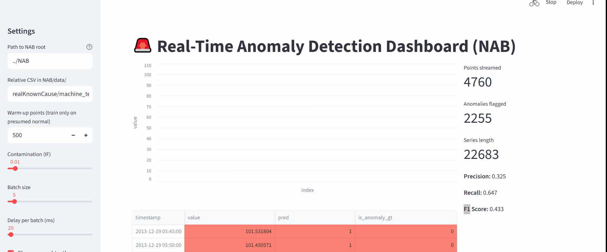

# 🚨 Real-Time Anomaly Detection Dashboard (NAB)

A portfolio-ready project demonstrating **real-time anomaly detection** on the **Numenta Anomaly Benchmark (NAB)** dataset.  

This project simulates **industrial sensor anomaly detection** with a live **Streamlit dashboard** for monitoring.  

---

## 🎯 Why This Project
In **Industrial AI**, early detection of anomalies in machine or sensor data can:
- Prevent costly equipment failures ⚙️  
- Improve worker and system safety 🦺  
- Enable predictive maintenance 🔧  
- Optimize industrial processes 📈  

This project demonstrates how real-time monitoring systems can be built using **machine learning, time-series data, and dashboards**.

---

## 📊 Demo

### Dashboard in Action


*(If the GIF doesn’t load, check it directly in the repo: `assets/demo.gif`)*

---

## 🚀 Features
- 🔄 **Simulated streaming** of NAB datasets  
- 🧠 **Anomaly detection** with Isolation Forest (swap with PyOD/deep learning)  
- 📈 **Interactive dashboard** with live charts & controls  
- 🟥 **Visual anomaly highlighting** (red dots on chart + red rows in table)  
- 📊 **Evaluation metrics** (Precision, Recall, F1 updated live)  

---

## ⚡ Quickstart

```bash
# 1) Clone your repo, then set up env
python -m venv venv
source venv/bin/activate  # Windows: venv\Scripts\activate
pip install -r requirements.txt

# 2) Get NAB dataset (official repo)
git clone https://github.com/numenta/NAB.git

# 3) Run the dashboard
streamlit run app.py
